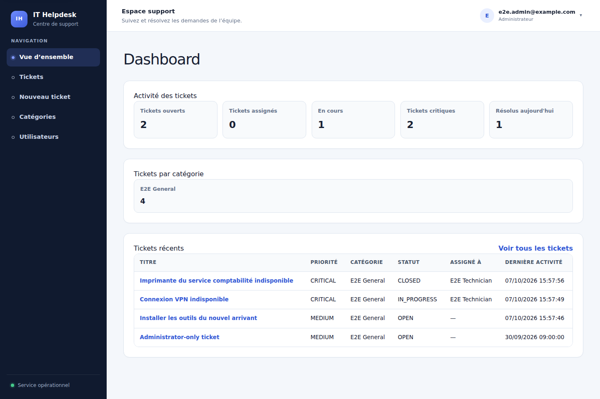

# IT Helpdesk

Application de support informatique construite comme un monolithe modulaire :
un ticket suit des règles métier explicites, chaque rôle dispose d'un périmètre
d'accès et les actions importantes alimentent un historique consultable.

## Problem

Un service informatique doit centraliser les demandes, attribuer leur traitement
et savoir qui a fait quoi. IT Helpdesk remplace un suivi informel par un workflow
traçable, du signalement à la clôture, avec une vue personnelle pour le demandeur
et une vue globale pour l'équipe de support.

## Features

- Connexion par email et mot de passe, rôles `USER`, `TECHNICIAN` et `ADMIN`.
- Création de tickets avec catégorie active et priorité ; liste filtrée et
  paginée à 20 tickets par page.
- Assignation, démarrage, résolution, clôture et modification de priorité.
- Commentaires et timeline des événements avec auteur et horodatage.
- Dashboard : états, priorités critiques, résolutions du jour, catégories et
  charge personnelle du technicien.
- Administration des catégories : création, modification et désactivation.
- Interface responsive, retours de formulaire et états vide, erreur et accès refusé.
- Image Docker de production, migrations versionnées et healthcheck PostgreSQL.

L'annulation et le changement de catégorie existent dans les cas d'utilisation,
mais ne sont pas encore exposés dans l'interface. La page utilisateurs est un
squelette réservé à l'administrateur ; elle ne constitue pas un CRUD complet.

## Architecture

`src/app` contient les pages, Server Actions et routes HTTP Next.js. Les modules
`auth`, `users`, `tickets`, `categories` et `comments` séparent domaine,
cas d'utilisation et infrastructure. Les mutations passent par des repositories ;
les lectures peuvent construire leurs projections directement avec Prisma.

Voir le [diagramme d'architecture](docs/architecture.md) et les
[décisions d'ingénierie](docs/engineering-decisions.md).

## Tech Stack

| Responsabilité | Technologie |
| --- | --- |
| Application et interface | Next.js 16.3.6 App Router, React 19, TypeScript |
| Styles | Tailwind CSS 4 et CSS applicatif |
| Authentification | Auth.js / `next-auth` 5 beta, Credentials et sessions JWT |
| Validation et mots de passe | Zod 4, Argon2 |
| Persistance | Prisma 7, adaptateur PostgreSQL `pg`, PostgreSQL 18 |
| Qualité | ESLint, Vitest, Playwright avec Chromium, GitHub Actions |
| Exécution | Node.js 22 en Docker, Node.js 24 en CI, pnpm 12.6 |

Les versions résolues sont figées dans [pnpm-lock.yaml](pnpm-lock.yaml).

## Domain Model

Un `User` crée des `Ticket` et peut recevoir des assignations. Chaque ticket
référence une `Category`, possède des `TicketComment` et des entrées
`TicketHistory`. La catégorie est obligatoire à la création ; sa relation reste
nullable dans le stockage pour les tickets historiques non classés.

```text
OPEN -> ASSIGNED -> IN_PROGRESS -> RESOLVED -> CLOSED
```

`CANCELLED` est également un état terminal. Le domaine refuse les transitions
invalides et les changements de priorité ou de catégorie après clôture ou
annulation. Voir le [cycle de vie détaillé](docs/ticket-lifecycle.md) et le
[schéma de persistance](prisma/schema.prisma).

## Authentication & Authorization

| Action | USER | TECHNICIAN | ADMIN |
| --- | --- | --- | --- |
| Créer un ticket | Oui | Oui | Oui |
| Consulter les tickets, métriques et commentaires | Ses tickets | Tous | Tous |
| Ajouter un commentaire | Ses tickets | Tous | Tous |
| Assigner, démarrer, résoudre, clôturer, changer la priorité | Non | Oui | Oui |
| Administrer les catégories | Non | Non | Oui |

Les techniciens peuvent gérer tous les tickets, même ceux assignés à un autre
technicien. Les permissions sont vérifiées côté serveur ; masquer un bouton
n'est pas une protection. L'identité de l'auteur provient de la session.

Les mots de passe sont hachés avec Argon2. La session a une durée absolue de huit
heures et vérifie l'activité du compte et sa `sessionVersion` en base. Une
désactivation ou une version différente invalide la session. Les en-têtes de
sécurité sont définis dans [next.config.ts](next.config.ts).

## Installation

Après clonage, utiliser Node.js 22 ou 24, pnpm 12.6 et Docker Compose :

```bash
git clone git@github.com:johnmabs/it-helpdesk.git
cd it-helpdesk
cp .env.example .env
openssl rand -base64 32
```

Renseigner `AUTH_SECRET` avec la valeur générée et les trois variables
`SEED_ADMIN_*` dans `.env`, puis :

```bash
pnpm install --frozen-lockfile
pnpm prisma generate
docker compose up -d --wait postgres
pnpm db:migrate:deploy
pnpm db:seed
pnpm dev
```

Ouvrir <http://localhost:3000/login>. Le seed crée uniquement l'administrateur ;
créer une catégorie depuis l'interface avant le premier ticket.

Le [guide local et de démonstration](docs/local-setup.md) détaille les variables,
le lancement entièrement Docker et le déploiement.

## Testing

```bash
pnpm lint
pnpm typecheck
pnpm test:unit
pnpm db:test:up
pnpm test:integration
pnpm exec playwright install --with-deps chromium
pnpm test:e2e
```

Les deux dernières suites utilisant PostgreSQL nécessitent `TEST_DATABASE_URL`
depuis `.env.example`. Elles modifient les données de la base de test et doivent
être exécutées successivement. La [stratégie de tests](docs/testing.md) décrit
les garanties de chaque niveau et les jobs de [CI](.github/workflows/ci.yml).

## Engineering Decisions

Le domaine reste indépendant de Prisma pour tester les règles sans base de
données. Les read queries utilisent des projections Prisma pour éviter une
abstraction inutile. Les mutations sont autorisées sur le serveur et le
hachage est encapsulé derrière un port. Un monolithe modulaire limite les coûts
de déploiement tout en gardant des frontières métier explicites.

Les [décisions et compromis](docs/engineering-decisions.md) exposent aussi les
limites actuelles : absence de transaction commune entre mutation et historique,
de contrôle de concurrence et de limitation des tentatives de connexion.

## Screenshots

La [galerie des sept écrans](docs/screenshots.md) présente la connexion, le
dashboard, la liste, la création, le détail, l'historique et les catégories.
Les captures utilisent exclusivement des données fictives.



## Roadmap

- Rendre atomiques la mutation et son événement d'historique ; ajouter un
  contrôle de concurrence pour éviter les mises à jour perdues.
- Exposer l'annulation et le changement de catégorie dans l'interface.
- Compléter la gestion des utilisateurs et l'invalidation lors des changements de rôle.
- Ajouter limitation des tentatives de connexion, récupération du mot de passe et MFA.
- Ajouter notifications, SLA, recherche et pièces jointes.
- Renforcer la CSP avec des nonces, l'observabilité et les procédures de sauvegarde.

Pour préparer une présentation en entretien, suivre le
[parcours portfolio](docs/portfolio.md).
