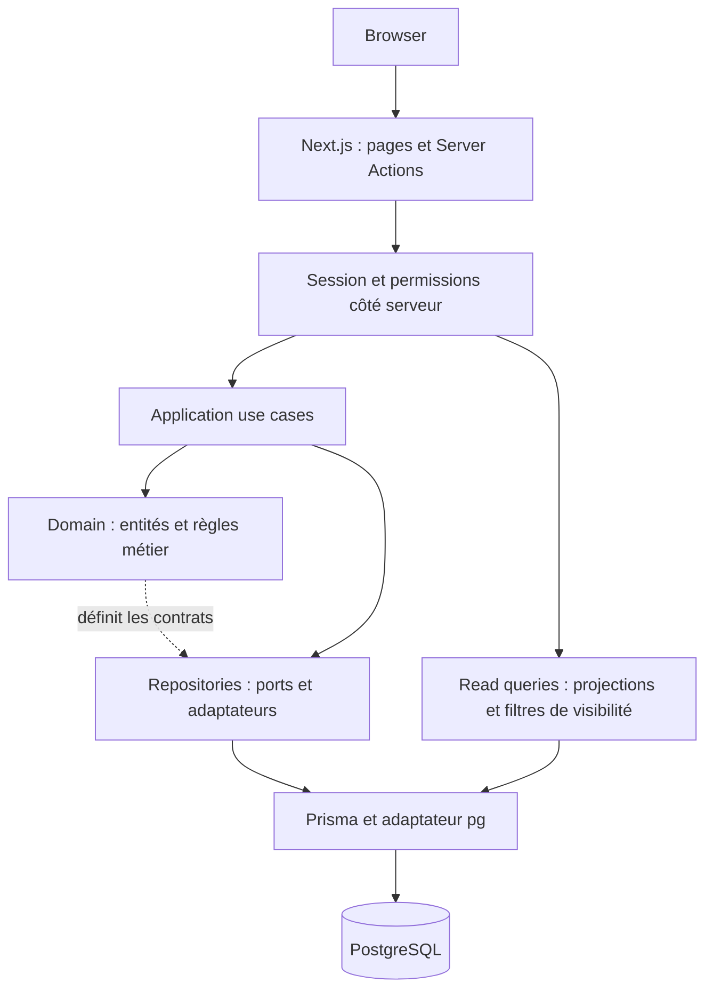

# Architecture

[Retour au README](../README.md)

## Parcours d'une mutation



Les flèches pleines montrent les appels à l'exécution. La flèche pointillée
montre la propriété des contrats : les interfaces de repository sont définies
dans le domaine, leurs implémentations Prisma dans l'infrastructure. Le domaine
ne connaît ni Prisma, ni PostgreSQL, ni Next.js.

Exemple : l'action d'assignation vérifie la session et le rôle, instancie
`AssignTicket` avec les adaptateurs, puis le cas d'utilisation charge le ticket
et l'utilisateur cible. Il vérifie que celui-ci est actif et technicien ou
administrateur, appelle `Ticket.assignTo`, sauvegarde et enregistre l'événement.
La page est ensuite revalidée.

## Organisation du dépôt

```text
src/
├── app/                         Pages, composants, Server Actions, routes HTTP
├── auth.ts / auth.config.ts     Auth.js et validation des sessions
├── proxy.ts                     Protection initiale des routes dashboard
├── modules/
│   ├── auth/
│   ├── users/
│   ├── tickets/
│   ├── categories/
│   └── comments/
│       ├── domain/              Entités, enums et ports
│       ├── application/         Cas d'utilisation et requêtes de lecture
│       └── infrastructure/      Persistance, mappers et services techniques
└── shared/                      Prisma, validation, erreurs, génération d'identifiants
prisma/                          Schéma, migrations et seed administrateur
e2e/                             Parcours navigateur et fixtures isolées
docs/                            Documentation et captures portfolio
.github/workflows/ci.yml          Audit, qualité, intégration, E2E, conteneur
```

Le module auth inclut une garde applicative qui dépend de Next.js ; la séparation
est pragmatique et ne prétend pas rendre toute la couche application indépendante
du framework. Les entités et cas d'utilisation de mutation métier restent
testables par injection de repositories en mémoire.

## Lectures et frontières de sécurité

Les requêtes `listTickets`, les métriques et les tickets récents utilisent Prisma
directement et retournent des projections adaptées à l'affichage. Le filtre
`createdById = viewer.id` est imposé pour `USER`. Le détail vérifie
`canViewTicket` avant d'afficher le résultat ; un ticket absent ou inaccessible
produit une page 404. L'ajout de commentaire vérifie aussi cette permission
dans son cas d'utilisation.

Les Server Actions composent les dépendances et autorisent les mutations. Les
cas d'utilisation du workflow reçoivent un `actorId` mais ne vérifient pas tous
le rôle eux-mêmes : toute nouvelle entrée HTTP ou tâche doit conserver cette
garde. Une interface cachée ou la seule protection du proxy ne suffit pas.

## Stockage et exploitation

Un processus applicatif Next.js et une base PostgreSQL constituent le système.
Prisma utilise l'adaptateur `pg` ; ses mappers convertissent les données vers les
entités métier. Les relations et index sont dans
[schema.prisma](../prisma/schema.prisma).

Compose démarre PostgreSQL, attend son healthcheck, exécute le service de
migration puis démarre l'application. Le seed est un service ponctuel du profil
`tools`. `/api/health` exécute `SELECT 1`, retourne 200 lorsque la base répond
et 503 sinon, sans divulguer l'erreur interne.

Le déploiement utilise la sortie Next.js `standalone`, une image en plusieurs
étapes et un utilisateur non privilégié. Il ne nécessite ni broker, ni service
supplémentaire, ni API séparée. Voir le [guide d'exécution](local-setup.md) et les
[compromis](engineering-decisions.md).
