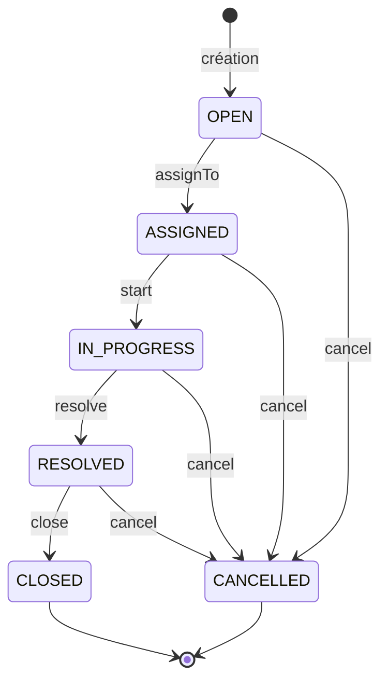

# Modèle métier et cycle de vie du ticket

[Retour au README](../README.md)

Le [domaine Ticket](../src/modules/tickets/domain/ticket.ts) est la source des
transitions autorisées. Les cas d'utilisation ajoutent les vérifications sur
les autres entités et la persistance ; les Server Actions appliquent les
permissions du workflow.

## Données métier

| Champ | Signification |
| --- | --- |
| `id` | Identifiant généré à la création |
| `title`, `description` | Texte normalisé par `trim`, non vide |
| `status` | État courant, initialement `OPEN` |
| `priority` | `LOW`, `MEDIUM`, `HIGH` ou `CRITICAL` |
| `createdById` | Auteur issu de la session côté serveur |
| `assignedToId` | Technicien ou administrateur actif ; null à la création |
| `categoryId` | Catégorie active obligatoire à la création ; stockage nullable pour l'historique |
| `createdAt`, `updatedAt` | Création et dernière mutation du ticket |
| `resolvedAt`, `closedAt` | Dates fixées lors de la résolution et de la clôture |

Une catégorie désactivée reste référencée par ses anciens tickets mais n'est
plus sélectionnable pour une création ou un changement de catégorie.

## Machine d'états

```text
OPEN -> ASSIGNED -> IN_PROGRESS -> RESOLVED -> CLOSED
```



| Opération | État requis | Effet |
| --- | --- | --- |
| Créer | Aucun | `OPEN`, pas d'assignation, dates de résolution/clôture nulles |
| Assigner | `OPEN` | `ASSIGNED`, renseigne `assignedToId` |
| Commencer | `ASSIGNED` | `IN_PROGRESS` |
| Résoudre | `IN_PROGRESS` | `RESOLVED`, renseigne `resolvedAt` |
| Clôturer | `RESOLVED` | `CLOSED`, renseigne `closedAt` |
| Annuler | Tout état sauf `CLOSED` et `CANCELLED` | `CANCELLED` |
| Modifier priorité/catégorie | Tout état sauf `CLOSED` et `CANCELLED` | État inchangé |

Chaque mutation actualise `updatedAt`. Il n'existe pas de réouverture ni de
réassignation après la première assignation. Une transition invalide lève
`InvalidTicketTransitionError`. L'annulation d'un ticket résolu conserve sa
date de résolution et son assignation ; il n'existe pas de champ `cancelledAt`.

Dans l'interface, techniciens et administrateurs peuvent faire avancer tous les
tickets, même ceux assignés à quelqu'un d'autre. L'annulation et le changement
de catégorie ont des cas d'utilisation testés mais pas encore de Server Action
ou de bouton dédié.

## Commentaires et historique

Un commentaire doit être non vide après normalisation. Son auteur provient de
la session et doit pouvoir consulter le ticket. Les commentaires restent
autorisés après clôture ou annulation ; le code ne bloque pas ces états.
Ajouter un commentaire ne met pas à jour `Ticket.updatedAt`.

`TicketHistory` conserve `ticketId`, `actorId`, `action`, `oldValue`, `newValue`
et `createdAt`. Les événements disponibles sont :

- `TICKET_CREATED` lors de la création ;
- `ASSIGNED` lors de l'assignation, avec les identifiants d'assignation ;
- `STATUS_CHANGED` au démarrage, à la résolution, à la clôture ou à l'annulation ;
- `PRIORITY_CHANGED` et `CATEGORY_CHANGED` avec ancienne et nouvelle valeur ;
- `COMMENT_ADDED`, dont `newValue` contient le texte du commentaire.

L'assignation change aussi le statut mais produit un seul événement `ASSIGNED`.
La timeline restitue les événements par ordre chronologique et résout les noms
des acteurs et des relations à la lecture. Ces noms ne sont pas des snapshots
historiques. Il n'y a pas d'édition de l'historique dans l'interface.

La sauvegarde métier et celle de l'événement sont deux écritures successives,
sans transaction commune. L'historique n'est donc pas un journal d'audit garanti
atomique ni un mécanisme d'event sourcing. Voir les
[décisions d'ingénierie](engineering-decisions.md).

## Preuves dans le dépôt

- [Tests des entités et transitions](../src/modules/tickets/domain/ticket.test.ts).
- [Tests des événements métier](../src/modules/tickets/application/ticket-audit-history.test.ts).
- [Tests de persistance PostgreSQL](../src/shared/tests/prisma-repositories.integration.test.ts).
- [Parcours E2E du cycle complet](../e2e/tickets/ticket-lifecycle.spec.ts).
